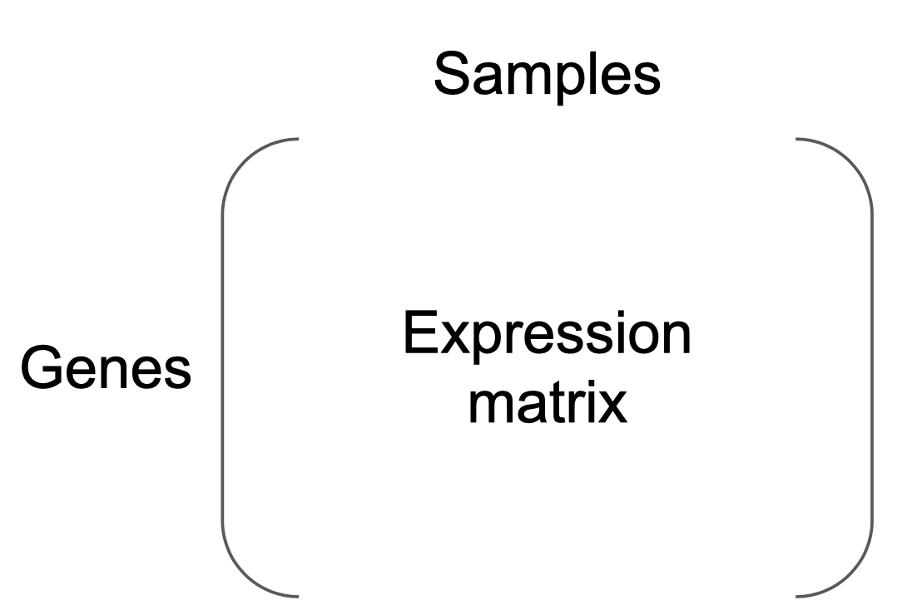
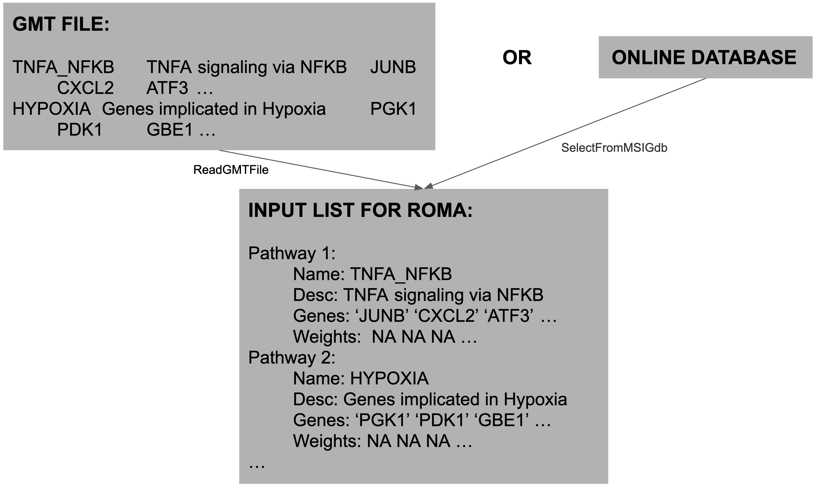

# rROMA package

The rROMA package provides an R implementation of the algorithm [ROMA](http://journal.frontiersin.org/article/10.3389/fgene.2016.00018/full).

A Java implementation developed by Andrei Zynovyev and co-authors is also [available](https://github.com/sysbio-curie/Roma).

Please visit our [vignette](https://sysbio-curie.github.io/rROMA/index.html) to install and run rROMA ! 


# Installing rROMA

The rRoma package relies on the `scater` and `biomaRt` packages, which are available only on BioConductor. These packages can be installed with the following command.
It also requires `ggplot2` for later descriptive plots.

```{r, eval=FALSE}

if (!require("BiocManager", quietly = TRUE))
    install.packages("BiocManager")

BiocManager::install("biomaRt")
BiocManager::install("scater")

if(!requireNamespace("ggplot2")){
  install.packages("ggplot2")
}
```

rRoma can then be installed using `devtools`.

```{r, eval=FALSE}
if(!requireNamespace("devtools")){
  install.packages("devtools")
}

if(!requireNamespace("rRoma")){
  devtools::install_github("sysbio-curie/rRoma")
}
```

rRoma uses the `mice` package to fill missing values. This package needs to be installed if analysed datasets contain missing values. However, we recommend using on datasets for which missing values have already been imputed.

```{r, eval=FALSE}
if(!requireNamespace("mice")){
  install.packages("mice")
}
```

# Using rROMA

The package can be loaded with the usual syntax, i.e. by typing

```{r}
library(rRoma)
```

rRoma requires a gene expression matrix, with column names indicating samples and row names indicating gene names.



It also requires a module file containing information on the genesets that need to be evaluated. The module file can be loaded from a GMT file (see example).



Various functions are then available to explore the analysis.


# An example: rRoma on a cystic fibrosis dataset

## Getting a dataset

Let us begin by getting the description of the dataset. This is a RNA sequencing dataset of human airway epithelial cultures from cystic fibrosis (CF) and non-CF donors from GSE176121, PMID: 34166230. rROMA was applied to compare between disease and healthy conditions (CF vs. non-CF).
Warning: rRoma works with **normalized** data. Here cpm from edgeR was used for normalisation, but you could also use vst from DeSeq2 or any other method you deem interesting.


```{r, eval=TRUE}
summary(MatData)
```

We can then load sample labels:

```{r, eval=TRUE}
summary(sample_labels)

Type <- sample_labels$Type
names(Type) <- sample_labels$sample_id
  
table(Type)
```


## Selecting the module list

Now that we have a normalized expression matrix with genes as rows and samples as columns, we need to define the pathway we want to test in our analysis. 
We can do that by loading a GMT file. Here, we extract all the "HALLMARK" genesets from MSigDB (Liberzon A et al, Cell Syst 2015). We also remove "HALLMARK_" from the names to simplify graphical representations. 

Note that we chose the Hallmark database for explanatory purpose. To have a more complete view of biological systems at stake in your study, we recommend using rRoma with multiple databases combined together.

```{r, eval=TRUE}
AllHall <- SelectFromMSIGdb("HALLMARK")

## [1] "Searching in MsigDB v6.2"
## [1] "The following genesets have been selected:"
##  [1] "HALLMARK_TNFA_SIGNALING_VIA_NFKB (200 genes)"          
##  [2] "HALLMARK_HYPOXIA (200 genes)"                          
##  [3] "HALLMARK_CHOLESTEROL_HOMEOSTASIS (74 genes)"           
##  [4] "HALLMARK_MITOTIC_SPINDLE (200 genes)"                  
##  [5] "HALLMARK_WNT_BETA_CATENIN_SIGNALING (42 genes)"        
##  [6] "HALLMARK_TGF_BETA_SIGNALING (54 genes)"                
##  [7] "HALLMARK_IL6_JAK_STAT3_SIGNALING (87 genes)"           
##  [8] "HALLMARK_DNA_REPAIR (150 genes)"                       
##  [9] "HALLMARK_G2M_CHECKPOINT (200 genes)"                   
## [10] "HALLMARK_APOPTOSIS (161 genes)"                        
## [11] "HALLMARK_NOTCH_SIGNALING (32 genes)"                   
## [12] "HALLMARK_ADIPOGENESIS (200 genes)"                     
## [13] "HALLMARK_ESTROGEN_RESPONSE_EARLY (200 genes)"          
## [14] "HALLMARK_ESTROGEN_RESPONSE_LATE (200 genes)"           
## [15] "HALLMARK_ANDROGEN_RESPONSE (101 genes)"                
## [16] "HALLMARK_MYOGENESIS (200 genes)"                       
## [17] "HALLMARK_PROTEIN_SECRETION (96 genes)"                 
## [18] "HALLMARK_INTERFERON_ALPHA_RESPONSE (97 genes)"         
## [19] "HALLMARK_INTERFERON_GAMMA_RESPONSE (200 genes)"        
## [20] "HALLMARK_APICAL_JUNCTION (200 genes)"                  
## [21] "HALLMARK_APICAL_SURFACE (44 genes)"                    
## [22] "HALLMARK_HEDGEHOG_SIGNALING (36 genes)"                
## [23] "HALLMARK_COMPLEMENT (200 genes)"                       
## [24] "HALLMARK_UNFOLDED_PROTEIN_RESPONSE (113 genes)"        
## [25] "HALLMARK_PI3K_AKT_MTOR_SIGNALING (105 genes)"          
## [26] "HALLMARK_MTORC1_SIGNALING (200 genes)"                 
## [27] "HALLMARK_E2F_TARGETS (200 genes)"                      
## [28] "HALLMARK_MYC_TARGETS_V1 (200 genes)"                   
## [29] "HALLMARK_MYC_TARGETS_V2 (58 genes)"                    
## [30] "HALLMARK_EPITHELIAL_MESENCHYMAL_TRANSITION (200 genes)"
## [31] "HALLMARK_INFLAMMATORY_RESPONSE (200 genes)"            
## [32] "HALLMARK_XENOBIOTIC_METABOLISM (200 genes)"            
## [33] "HALLMARK_FATTY_ACID_METABOLISM (158 genes)"            
## [34] "HALLMARK_OXIDATIVE_PHOSPHORYLATION (200 genes)"        
## [35] "HALLMARK_GLYCOLYSIS (200 genes)"                       
## [36] "HALLMARK_REACTIVE_OXIGEN_SPECIES_PATHWAY (49 genes)"   
## [37] "HALLMARK_P53_PATHWAY (200 genes)"                      
## [38] "HALLMARK_UV_RESPONSE_UP (158 genes)"                   
## [39] "HALLMARK_UV_RESPONSE_DN (144 genes)"                   
## [40] "HALLMARK_ANGIOGENESIS (36 genes)"                      
## [41] "HALLMARK_HEME_METABOLISM (200 genes)"                  
## [42] "HALLMARK_COAGULATION (138 genes)"                      
## [43] "HALLMARK_IL2_STAT5_SIGNALING (200 genes)"              
## [44] "HALLMARK_BILE_ACID_METABOLISM (112 genes)"             
## [45] "HALLMARK_PEROXISOME (104 genes)"                       
## [46] "HALLMARK_ALLOGRAFT_REJECTION (200 genes)"              
## [47] "HALLMARK_SPERMATOGENESIS (135 genes)"                  
## [48] "HALLMARK_KRAS_SIGNALING_UP (200 genes)"                
## [49] "HALLMARK_KRAS_SIGNALING_DN (200 genes)"                
## [50] "HALLMARK_PANCREAS_BETA_CELLS (40 genes)"

AllHall <- lapply(AllHall, function(x){
  x$Name <- sub("HALLMARK_", "", x$Name)
  x
})
```
In case you already have a GMT file with modules you want to test, you can also load them by using the `ReadGMTFile` function. 

## Performing rROMA: basics

You can now run rRoma on our dataset by simply specifying the expression dataset and the modules you want to test. Here we are fixing the seed for used for random permutations.
```{r, message = FALSE, results='hide', warning = FALSE}
# set.seed(69)
rRoma.output <- rRoma.R(MatData, AllHall)
```

## Reading the output

The most important information can be found in the module matrix, here in `rRoma.output$ModuleMatrix`. It contains p and q values for overdispersion (L1) and shift (Median Exp) for all tested modules. 

```{r}
head(rRoma.output$ModuleMatrix)

##                                   L1 Median L1 ppv L1    L1/L2 Median L1/L2
## TNFA_SIGNALING_VIA_NFKB    0.1809479 0.2212104   0.95 1.103873     1.356797
## HYPOXIA                    0.1747907 0.2243734   0.99 1.137466     1.367389
## CHOLESTEROL_HOMEOSTASIS    0.2270088 0.3097119   0.95 1.458432     1.772807
## MITOTIC_SPINDLE            0.1737191 0.2212104   1.00 1.167411     1.356797
## WNT_BETA_CATENIN_SIGNALING 0.3222136 0.3560736   0.60 1.529207     1.751907
## TGF_BETA_SIGNALING         0.2287674 0.3286938   0.99 1.194487     1.659751
##                            ppv L1/L2   Median Exp ppv Median Exp q L1 q L1/L2
## TNFA_SIGNALING_VIA_NFKB         0.95  0.142511308           0.45    1       1
## HYPOXIA                         0.87 -0.012509057           0.98    1       1
## CHOLESTEROL_HOMEOSTASIS         0.78  0.008574073           0.97    1       1
## MITOTIC_SPINDLE                 0.86  0.128220680           0.54    1       1
## WNT_BETA_CATENIN_SIGNALING      0.70  0.151428338           0.19    1       1
## TGF_BETA_SIGNALING              0.95 -0.024187817           0.86    1       1
##                            q Median Exp
## TNFA_SIGNALING_VIA_NFKB       0.9823529
## HYPOXIA                       0.9823529
## CHOLESTEROL_HOMEOSTASIS       0.9823529
## MITOTIC_SPINDLE               0.9823529
## WNT_BETA_CATENIN_SIGNALING    0.9823529
## TGF_BETA_SIGNALING            0.9823529
```

We are interested in two different types of modules:

* **Shifted modules**, whose genes behave differently from the rest of the genes in at least one sample. Corresponding p value is in `ppv Median Exp`. A q value is also calculated and given in `q Median Exp`. Here we will consider a module as shifted if p < 0.05. We don't look at q values here as both the number of samples and the number of tested modules is small. Consider looking at q values for larger data sets.

* **Overdispersed modules**, for which the approximation to one PC is correct. Corresponding p value is in `ppv ML1`. A q value is also calculated and given in `q L1`. Here we will consider a module as overdispersed if p < 0.05. We don't look at q values for the same reason as before, but considered looking at it for larger datasets.

### Shifted Modules

We are first interested in shifted modules.

```{r}
shifted.modules <- which(rRoma.output$ModuleMatrix[, "ppv Median Exp"] <= 0.05)
```

We want to see which samples are responsible for the shift. This can be done by looking at Sample Scores. The function plots a heatmap of these score:

```{r}
Plot.Genesets.Samples(rRoma.output, Selected = shifted.modules, GroupInfo = Type, cluster_cols = TRUE)

## [1] "3 genesets selected"
## [1] "12 samples have an associated group"
```


In case we didn't know the groups before the analysis, this representation can help us define groups of samples that behave similarly on a pathway level.
Here we already knew the groups. We can see that GSM5356221 behaves as an outlier. It could be interesting to look at metadata to understand why he behaves differently. Here we see that genes related to Apical surface, fatty acid metabolism and heme metabolism tend to be more expressed in cf patients.

We can also visualize how much the module is shifted compared to random gene sets. In particular, we're interested in PC1 median expression since we focus on shifted pathways:
```{r}
Plot.Genesets.vs.Sampled(rRoma.output, Selected = shifted.modules, Plot = "PC1Median")

## [1] "3 genesets selected"
```


The boxplot corresponds to the distribution of median PC1 expression for random gene sets (null distribution), while the red dot corresponds to the value obtained for the tested module. Here we can see that APICAL_SURFACE is the most shifted pathway.

### Overdispersed Modules
We can then focus on Overdispersed modules. Note that overdispersion is calculated for all modules, including the shifted one. However interpretation of overdispersion for shifted pathways might be misleading. Focusing on pathways that are overdispersed but not shifted will lead to more interpretable results.

```{r}
overdispersed.modules <- which(rRoma.output$ModuleMatrix[, "ppv L1"] <= 0.05 & rRoma.output$ModuleMatrix[, "ppv Median Exp"] > 0.05)
```

For such pathways we are interested in both sample scores and gene scores. The former tells us in which sample the effect of the factor is the biggest, while the later tells us which genes are the most important for this module. Overdispersed representation is particularly interesting in modules containing genes that are both activated and inhibited by the pathway.

We first plot the same heatmap as before to visualize sample scores:
```{r}
Plot.Genesets.Samples(rRoma.output, Selected = overdispersed.modules, GroupInfo = Type, cluster_cols = TRUE)

## [1] "1 genesets selected"
## [1] "12 samples have an associated group"
```


It appears that this module is also interesting to compare CF versus control samples.

Then we look at gene weights. To do this we use the `GetTopContrib` function.

When using this function, the number of selected genes can be specified via the ratio of genes of the module (nGenes larger than 0 and smaller than 1) or via the absolute number of genes to return (nGenes integer and larger than 1). Additionally, top contributing genes can be obtained via their correlation with the module score (Mode = "Cor") of via their weight (Mode = "Wei") (recommended). To use correlation the expression matrix needs to be specified (via the ExpressionMatrix parameter).

The function will return a table (Table) with the computed information and the matrix used to produce the heatmap (VizMat). The summary heatmap will be plotted only if Plot = TRUE. Here, we will see the 10% of genes in the module that are the most important for this module.

```{r}
GeneMat <- GetTopContrib(rRoma.output,
                         Selected = overdispersed.modules,
                         nGenes = 0.1, OrderType = "Abs", Mode = "Wei", Plot = TRUE)
```


```{r}
GeneMat$Table

##              Gene      Module    Weight
## GSN           GSN COAGULATION 15.603510
## SERPINA1 SERPINA1 COAGULATION -6.156917
## FN1           FN1 COAGULATION -5.663831
## ITGB3       ITGB3 COAGULATION -3.560363
## PLAT         PLAT COAGULATION -3.431828
## PLAU         PLAU COAGULATION -3.420021
## MMP9         MMP9 COAGULATION -3.366812
## PRSS23     PRSS23 COAGULATION  3.134257
## F12           F12 COAGULATION -3.001901
## SERPINE1 SERPINE1 COAGULATION -2.698196
## KLKB1       KLKB1 COAGULATION -2.675976
## TIMP3       TIMP3 COAGULATION  2.585418
## C1R           C1R COAGULATION -2.497833
## RAPGEF3   RAPGEF3 COAGULATION -2.281372
```

Similarly to shifted pathways, we can visualize by how much the pathway is overdispersed using `Plot.Genesets.vs.Sampled`, this time looking at the % of variance explained by the PC1:
```{r}
Plot.Genesets.vs.Sampled(rRoma.output, Selected = overdispersed.modules, Plot = "L1")
```


### Other interesting Plots

#### Statistical comparison across samples

In cases where groups are known, we can quantify differences between groups in terms of modules, by comparing sample scores, i.e the activity of tested modules in the different groups.

It is possible to first look at a global scale:

```{r}
GlobalCompareAcrossSamples(RomaData = rRoma.output,
                     Selected = c(overdispersed.modules, shifted.modules),
                     Plot = "both",
                     Groups = Type)
                     
## [1] "4 geneset(s) selected"
## [1] "Performing Type III AOV (R default)"
##             Df Sum Sq Mean Sq F value   Pr(>F)    
## Group        1  1.333   1.333   22.98 1.75e-05 ***
## Residuals   46  2.667   0.058                     
## ---
## Signif. codes:  0 '***' 0.001 '**' 0.01 '*' 0.05 '.' 0.1 ' ' 1
```


Then at a module scale. For all modules an ANOVA is performed first, followed by wilcoxon test for each 2 by 2 group comparison.
```{r}
GlobalCompareAcrossSamplesGenesets(RomaData = rRoma.output,
                     Selected = c(overdispersed.modules, shifted.modules),
                     Groups = Type)
                     
## [1] "4 geneset(s) selected"
## [1] "Performing Type III AOV (R default) for each geneset"
##               Df Sum Sq Mean Sq F value   Pr(>F)    
## Group          1 1.3328  1.3328  21.278 4.03e-05 ***
## Group:GeneSet  6 0.1618  0.0270   0.431    0.854    
## Residuals     40 2.5054  0.0626                     
## ---
## Signif. codes:  0 '***' 0.001 '**' 0.01 '*' 0.05 '.' 0.1 ' ' 1
```


#### Undestanding outliers

The computation of the PC1 can be affected even by a single outlier in the data set. In order to increase robustness of the PC1 computation, we apply here the “leave-one-out" cross-validation approach (see article for details). This way we can remove outliers from our dataset before calculating PC1.
However this kind of outliers removal might lead to removing too many genes in a given module, changing the interpretation of the results. Several filtering steps are thus performed in order to limit the amount of genes considered as outliers:

-Filtering based on Fisher exact test: is a given gene considered outlier in the same proportion as a random gene ? (see article for details)

-Filtering to keep genes characteristic of a small number of modules

-Restricting the number of outliers to a maximum of X% of the size of the module

These filtering steps can be visualized on plots and used as a baseline to potentially adapt the filtering hyperparameters (see Performing Roma: changing hyperparameters) by using the `PlotOutliers` function.

Three plots are available:

Plot_L1 helps visualize the leave-one-out approach. For each gene, the % of variance explained by PC1 upon removal of the given gene is plotted.
```{r}
rRoma::PlotOutliers(rRoma.output, MatData,
  Selected = c(overdispersed.modules, shifted.modules),
  Plot_L1 = TRUE,
  Plot_Weights = FALSE,
  Plot_Projection = FALSE)
```


Plot weights shows the weights of the genes in case no outliers were removed (i.e projetion on PC1).
```{r}
rRoma::PlotOutliers(rRoma.output, MatData,
  Selected = c(overdispersed.modules, shifted.modules),
  Plot_L1 = FALSE,
  Plot_Weights = TRUE,
  Plot_Projection = FALSE)
```


Plot_Projections plots genes in the PC1/PC2 space.
```{r}
rRoma::PlotOutliers(rRoma.output, MatData,
  Selected = c(overdispersed.modules, shifted.modules),
  Plot_L1 = FALSE,
  Plot_Weights = FALSE,
  Plot_Projection = TRUE)
```


Here we can see that almost all genes that were initially considered as outliers were actually retained, as they were all characteristic for a very small number of modules. It would be interesting to see what changes if we consider these as outliers anyway (see Performing Roma: changing hyperparameters).


#### Looking at the orientation of the PCs

In the case of overdispersed modules that are not shifted, all components are computed with undefined orientation sign. Several methods exist to try to orient the PCs (see Choosing the PC orientation procedure). It is possible to visualize both gene weights and expressions for all genes in a given module in order to assess whether PC oroentation seems correct.

```{r}
PlotGeneWeight(RomaData = rRoma.output, PlotGenes = 30,
               ExpressionMatrix = MatData, LogExpression = FALSE,
               Selected = c(overdispersed.modules, shifted.modules))
               
## [1] "4 geneset(s) selected"
```


The same kind of plot can be obtained with samples:

```{r}
PlotSampleProjections(RomaData = rRoma.output, PlotSamples = 30,
                      ExpressionMatrix = MatData, LogExpression = FALSE,
                      Selected = c(overdispersed.modules, shifted.modules))
                      
## [1] "4 geneset(s) selected"
```


#### Visualizing modules in the PC space

Amongst the most interesting plots to understand shift and overdispersion is the PC1/PC2 projection of the genes of a given module against the background for null distribution. Such a plot is available with the `PlotPCProjections` function:

```{r}
PlotPCProjections(RomaData = rRoma.output, Selected = c(overdispersed.modules, shifted.modules),
                  PlotPCProj = c('Points'))

## [1] "4 geneset(s) selected"
```


Here we can clearly the shift for the modules we investigated previously, althought we can see it is only a small effect.

#### Focusing on a given gene

It is also possible to plot multiple information on a specific gene accross all studied modules.
Here we'll take SERPINE1 as a case study, since it is present in 9 Hallmark pathways, including Coagulation, which we found to be overdispersed.
Several plots are available within the `ExploreGeneProperties` function:

-PlotExpVar plots the expression variance of the studied gene compared to all other genes in the dataset

-PlotExpMean plots the expression mean of the studied gene compared to all other genes in the dataset

-PlotExpDist plots the distribution of the expression of the studied gene in all samples, and in groups (with differential expression testing) if specified

-PlotWeight plots the gene weight in each of the considered gene sets, compared to all other gene weights. % shows the position of the gene in terms of absolute value

-PlotExpSampleScore plots gene expression against sample score for all considered gene sets and tries to fit a line

Here, we plot all of them (`Selected=NULL` is equivalent to selecting all modules).

```{r}
ExploreGeneProperties(
  rRoma.output,
  "SERPINE1",
  MatData,
  Selected = NULL,
  GroupInfo = Type,
  PlotExpVar = TRUE,
  PlotExpMean= TRUE,
  PlotExpDist = TRUE,
  PlotWeight = TRUE,
  PlotExpSampleScore = TRUE
)
```


```{r}
## [1] "Gene found in 9 modules"
```

```{r}
## `geom_smooth()` using method = 'loess' and formula 'y ~ x'
```


Here we can see that Serpine1 is an important gene in most of the modules it is included in. This gene is also differentially expressed between CF and non-CF.

## Performing Roma: changing hyperparameters

Even thought you can run Roma with nothing more than an expression matrix and a list of modules to analyse, the algorithm accepts many hyperpatameters that can be changed to best adapt to your needs. Here we will explain how to use all of them.

### Centering Data

Roma's interpretation is correct only if the data is already centered at the global scale, i.e all genes have a mean of 0 accross samples. By default Roma starts by centering the data, however it is possible to skip this step by specifying `centerData=FALSE`. We recommend doing so only if your data is already centered, to fasten the analysis.

### Removing abnormal samples before analysis

Counts detection for some samples might have been incorrectly performed in some samples, and keeping them might lead to incorrect results from Roma. By specifying `ExpFilter=TRUE`, 2 filtering steps are performed. We first make sure that a similar number of genes is detected in all samples, the threshold being defined by `OutGeneNumber`. Then samples are projected in the gene space and make sure no sample lies to far from the rest. The number of PCs used to perform filtering at this step is defined by `NComp`, and the threshold is defined by `OutGeneSpace` (note that in case this parameter is set to NULL, no filtering based on projecting samples in the gene space is performed)
By default some filtering is not performed, as the input matrix is supposed to be already clean.

### Using prior knowledge on gene weights in modules

It is possible to input prior knowledge about your modules in Roma by changing prior gene weights. By defaut all prior gene weights are initialized to 1 (this default value can be changed with the `DefaultWeight` argument). These weights can be increased for some genes known to be more relevant than the others for a given module, or the sign of the weight can be changed to account for activators/inhibitors. Gene weights must be changed in the modules' GMT file, and will be taken into acount only if `UseWeights = TRUE`.

### Sticking to modules with an acceptable number of genes

The parameters `MinGenes` and `MaxGenes` determines the minimum and the maximum number of genes from a module that can be in the expression dataset in order for the module to be considered in Roma's analysis.

### Calculating background null hypothesis

In order to check whether modules are overdispersed/shifted, their L1 and Median Exp (for PC1) value are compared to L1s and Median Exp values calculated for random subset of genes of similar size. This step is very time consuming and a tradeof must be found between precision and speed.
In order not to redefine new random gene sets for each module, modules of similar sizes share the same background gene sets. The % of difference needed in terms of numbers of genes to generate new random gene sets can be changed using the `ApproxSamples` parameter.
The number of random gene sets generated at each step is defined by `nSamples`. It is at 100 by default. A higher number will result in more precision in later p value calculation, but will also be more time consuming. We don't advise going under 100.
It is also possible to decide whether or not randomly selected gene sets can include genes from the module they are compared to, using `GeneSelMode`. Finally, it is possible to choose whether or not outliers should be filtered out in those sets using `SampleFilter`.

Note: The number of PCs calculated for both modules and random gene sets can be changed with `PCADims` (2 by default). However we don't recommend changing it as 2 is a necessary and sufficient number of dimension to compute all features of Roma.

### Detecting outliers

Several methods exist to filter out outliers. Choice is made with the `GeneOutDetection` parameter (see function documentation for details). You can be more or less stringent by changing `GeneOutThr`.
As explained in Undestanding outliers, there are then later steps to reduce the number of outliers. 
`OutlierRarelyFoundThr` lets you choose the minimum number of modules a gene has to belong to in order to be potentially considered as an outlier.
`OutlierFisherThr` lets you choose the p value threshold for the fisher test.
`OutliersPerc` lets you choose the maximum ratio of genes that can be outliers in a module.

### Choosing the PC orientation procedure

Several PC orientation procedures are available and can be chosen by changing the `PCSignMode` parameters. See function documentation for details about available options.
Some methods require a threshold, which can be set up using the `PCSignThr` parameter. Also, some methods can use advantage of information on groups, which can be provided with the `Grouping` parameter, and specifying `GroupPCSign=FALSE`. Finally, some methods rely on correlation. The type of correlation to perform can be choosen using the `CorMethod` parameter.
We recommend using `PCSignMode=UseMeanExpressionAllWeights` with `PCSignThr=0.9`. However, note that none of the proposed methods is perfect, and it is recommend to manually check the sign for overdispersed modules.

### Speeding up calculation with parallelization 

A parallel environment can be used to speed up calculation (however this will increase memory usage). It can be activated with the `UseParallel` parameter. The number of cores is defined by `nCores`, and the type of cluster ty use by `ClusType`.

### Data imputation

In case the data contains missing values, Roma starts by imputing them using mice. More parameters can be passed to the mice function using `FillNAMethod`.We however recommend you perform your own imputation beforehands.

### Saving information for randomized genesets

It is possible to speed up calculation by not saving results for randomized genesets, by specifying `FullSampleInfo=FALSE`. However in that case some plots can no longer be drawn.
It is also possible not to perform PC sign orientation on randomized genesets by specifying `SampleSign=FALSE`, again to speed up calculation.

### Verbosity

If `MoreInfo=TRUE`, more detailed information on the computation be printed, while `SuppressWarning=TRUE` will limit the amount of information outputed.


## Using rRoma: recommended settings

We recommend the following parameters for a first use of Roma, to have a good tradeoff between speed and memory usage. However in case it doesn't bother you to le the analysis run for a longer time we recommend increasing `nSamples` (to 1000 or 10000) as it will result in more precise p values.
`OutlierRarelyFoundThr` should be placed at about 5% of the total number of modules you are testing.

```{r, message = FALSE, results='hide', warning = FALSE}
rRoma.output.2 <- rRoma.R(ExpressionMatrix = MatData, ModuleList = AllHall, UseWeights = TRUE, DefaultWeight = 1, GeneOutDetection = 'L1OutExpOut', PCSignMode = "UseMeanExpressionAllWeights", OutGeneSpace = 5, UseParallel = TRUE, nCores = 3, ClusType = "FORK", OutlierRarelyFoundThr = 2)
```